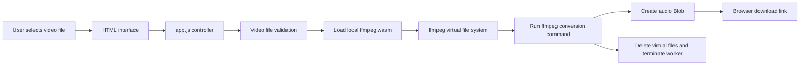
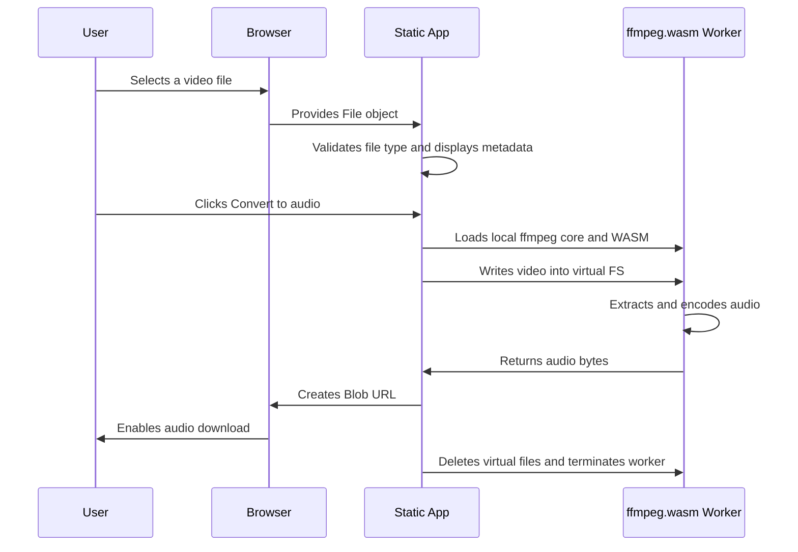
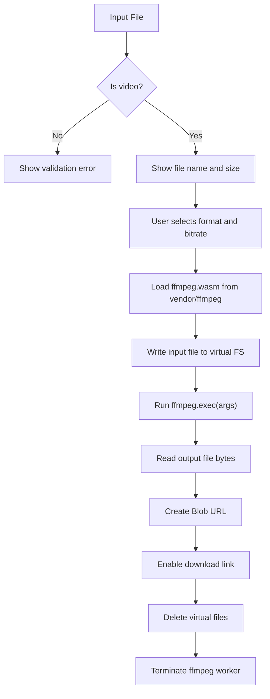

# BeeTales Video to Audio Converter

BeeTales Video to Audio Converter is a fully static browser application that extracts audio from video files using ffmpeg.wasm. All processing happens locally in the user's browser. The selected video is never uploaded to a server.

## Project Summary

| Area | Details |
|---|---|
| Application type | Static web application |
| Runtime | Browser only |
| Backend | None |
| Database | None |
| Uploads | None |
| Cookies | None |
| Analytics | None |
| Conversion engine | ffmpeg.wasm |
| Supported output formats | MP3, WAV, AAC |
| Supported bitrates | 128k, 192k, 320k |
| Primary files | `index.html`, `style.css`, `app.js` |
| Local engine files | `vendor/ffmpeg` |
| Visual assets | `assets` |

## What the Page Does

The application lets a user select a local video file, choose an audio format and bitrate, convert the video to audio in the browser, and download the converted audio file.

No file is transmitted outside the browser. The video is loaded into ffmpeg.wasm's virtual file system, processed locally, converted into a Blob, and exposed through a temporary browser download URL.

## Technical Architecture



## Browser-Only Processing Model



## File and Folder Structure

```text
video-to-audio-web/
|-- index.html
|-- style.css
|-- app.js
|-- README.md
|-- README2.md
|-- assets/
|   |-- beetales-converter-hero.png
|   `-- beetales-logo.png
`-- vendor/
    `-- ffmpeg/
        |-- ffmpeg/
        |-- core/
        `-- util/
```

| Path | Purpose |
|---|---|
| `index.html` | Defines the application markup, form controls, status area, privacy notice, brand layout, and download link. |
| `style.css` | Provides the dark responsive UI, purple brand palette, layout rules, panels, controls, progress bar, and mobile behavior. |
| `app.js` | Handles file validation, ffmpeg.wasm loading, conversion commands, progress updates, cleanup, errors, and download URL creation. |
| `assets/` | Stores the BeeTales logo and the generated hero image used by the interface. |
| `vendor/ffmpeg/ffmpeg/` | Local ESM files for the ffmpeg.wasm JavaScript wrapper. |
| `vendor/ffmpeg/core/` | Local ffmpeg core JavaScript and `ffmpeg-core.wasm`. |
| `vendor/ffmpeg/util/` | Local utility functions used to read selected files into ffmpeg.wasm. |

## Frontend Components

| Component | HTML/CSS selector | Responsibility |
|---|---|---|
| Brand mark | `.brand-mark` | Displays the BeeTales logo and local-converter label. |
| Hero visual | `.brand-visual` | Shows the visual concept for converting video into audio. |
| File picker | `#video-file`, `.drop-zone` | Lets the user select or drag a video file. |
| File metadata | `#file-card`, `#file-name`, `#file-size` | Displays selected file name and size. |
| Output format controls | `input[name="format"]` | Selects MP3, WAV, or AAC. |
| Bitrate controls | `input[name="bitrate"]` | Selects 128k, 192k, or 320k. |
| Conversion button | `#convert-button` | Starts the conversion workflow. |
| Progress indicator | `#progress-bar`, `#status-message` | Shows conversion progress and current state. |
| Download link | `#download-link` | Downloads the generated audio Blob. |
| Error message | `#error-message` | Shows friendly user-facing errors. |

## Conversion Pipeline



## ffmpeg Command Strategy

The application builds conversion arguments based on the selected output format.

| Output | Audio codec | Container / format | Bitrate behavior |
|---|---|---|---|
| `mp3` | `libmp3lame` | `mp3` | Uses selected bitrate |
| `wav` | `pcm_s16le` | `wav` | Bitrate is not applied |
| `aac` | `aac` | `adts` | Uses selected bitrate |

The command always maps the first available audio stream:

```text
-map 0:a:0
```

This keeps the conversion focused on the primary audio track and avoids exporting video data.

## Runtime Behavior

| Step | Implementation detail |
|---|---|
| Load engine | `ffmpeg.load({ coreURL, wasmURL })` using local static files. |
| Read input | `fetchFile(selectedFile)` converts the browser `File` into data ffmpeg.wasm can consume. |
| Write input | `ffmpeg.writeFile(inputName, data)` stores the video in ffmpeg's virtual file system. |
| Execute conversion | `ffmpeg.exec(args)` runs the selected conversion command. |
| Read output | `ffmpeg.readFile(outputName)` retrieves the generated audio bytes. |
| Create download | `URL.createObjectURL(blob)` creates a browser-local download URL. |
| Cleanup | `ffmpeg.deleteFile(...)` removes temporary virtual files. |
| Release memory | `ffmpeg.terminate()` stops the worker after conversion. |

## Privacy and Security Design

| Concern | How the app handles it |
|---|---|
| File privacy | The selected video stays in the user's browser. |
| Network uploads | No upload endpoint exists. |
| Server processing | No backend is used. |
| Cookies | No cookies are created. |
| Tracking | No analytics scripts are included. |
| Temporary output | The audio file is served through a local Blob URL. |
| Memory cleanup | Virtual ffmpeg files are deleted and the worker is terminated after conversion. |

## Static Asset Strategy

The app includes ffmpeg.wasm locally under `vendor/ffmpeg`. This avoids depending on a CDN during conversion and prevents browser issues caused by cross-origin workers.

| Asset group | Reason |
|---|---|
| `vendor/ffmpeg/ffmpeg` | Provides the ffmpeg JavaScript API. |
| `vendor/ffmpeg/core` | Provides `ffmpeg-core.js` and `ffmpeg-core.wasm`. |
| `vendor/ffmpeg/util` | Provides utility helpers such as `fetchFile`. |
| `assets` | Provides the BeeTales logo and hero visual. |

## Browser Compatibility Notes

| Browser requirement | Reason |
|---|---|
| WebAssembly support | Required by ffmpeg.wasm. |
| Web Worker support | ffmpeg runs in a worker. |
| Blob URL support | Required for local audio download. |
| ES module support | The app uses native browser modules. |
| Sufficient memory | Large video files require more browser memory. |

The app is designed for modern versions of Chrome, Edge, Firefox, and other evergreen browsers.

## Deployment Requirements

Because the app uses JavaScript modules, WebAssembly, and worker files, it should be served from a real web server.

Do not deploy only `index.html`, `style.css`, and `app.js`. The following folders must also be deployed:

```text
assets/
vendor/
```

The server should serve `.wasm` files with:

```text
application/wasm
```

## Example Nginx Configuration

```nginx
server {
    listen 80;
    server_name your-domain.com;

    root /var/www/video-to-audio-web;
    index index.html;

    location / {
        try_files $uri $uri/ =404;
    }

    types {
        text/html html;
        text/css css;
        application/javascript js;
        application/wasm wasm;
    }

    add_header X-Content-Type-Options nosniff;
}
```

## Local Development

Use a local static server:

```bash
cd video-to-audio-web
python3 -m http.server 8080
```

Then open:

```text
http://localhost:8080
```

## Error Handling

| Error category | User-facing behavior |
|---|---|
| Invalid file type | Displays a clear message asking for a video file. |
| Engine loading timeout | Asks the user to refresh and try again. |
| Missing audio stream | Explains that no compatible audio track was found. |
| Browser memory issue | Suggests a smaller file or closing other tabs. |
| Empty output | Suggests trying another output format. |
| Unknown conversion failure | Shows a general friendly conversion error. |

## Performance Notes

| Factor | Impact |
|---|---|
| Video duration | Longer videos take more time to process. |
| File size | Larger files consume more memory. |
| Output format | WAV can generate larger files than MP3 or AAC. |
| Browser memory | Low memory can stop conversion. |
| First run | The browser must load the local WASM engine. |

## Design System

| Token / style | Value |
|---|---|
| Theme | Dark, minimal, responsive |
| Primary accent | Purple based on `#9130D1` |
| UI shape | Compact panels with `8px` radius |
| Visual identity | BeeTales logo and video-to-audio hero image |
| Layout | Two-column desktop, single-column mobile |

## Limitations

- Very large videos may exceed browser memory limits.
- Conversion speed depends on the user's device.
- DRM-protected or corrupted videos may not convert.
- Videos without compatible audio tracks cannot produce audio output.
- The app is static and does not provide server-side batch processing.

## License and Attribution Notes

This project bundles local ffmpeg.wasm distribution files under `vendor/ffmpeg`. Review the upstream package licenses before publishing or redistributing the project publicly.
