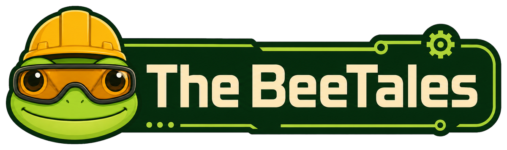
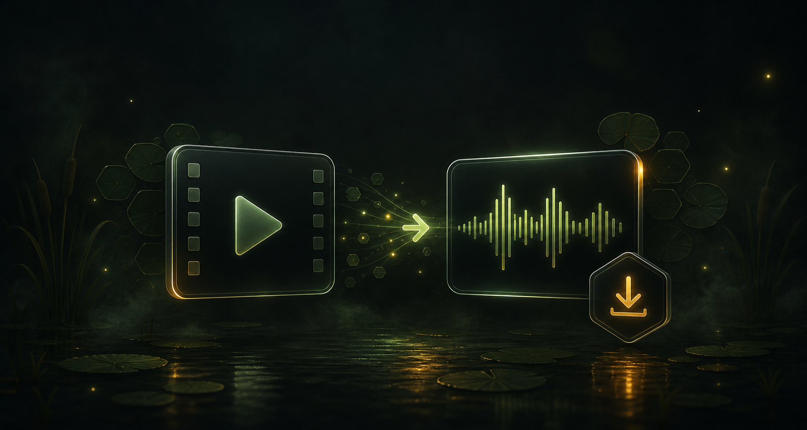
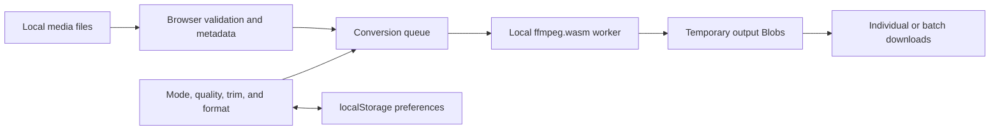

<p align="center">
  
</p>

<h1 align="center">BeeTales Media Converter</h1>

<p align="center">
  A private, open-source media converter that runs entirely in the browser.
</p>

<p align="center">
  <a href="https://github.com/Sorairei/beetales-converter"><strong>View the repository</strong></a>
  ·
  <a href="https://github.com/Sorairei/beetales-converter/issues">Report an issue</a>
  ·
  <a href="https://github.com/sponsors/Sorairei">Sponsor the project</a>
</p>

<p align="center">
  <a href="LICENSE"></a>
  
  
  <a href="https://github.com/sponsors/Sorairei"></a>
</p>

<p align="center">
  
</p>

## Overview

BeeTales Media Converter extracts audio, converts or optimizes MP4 video, and creates animated GIF clips without uploading source files. Conversion happens inside the user's browser with the locally bundled ffmpeg.wasm runtime.

The application is made from static HTML, CSS, JavaScript, images, and WebAssembly files. It requires no backend, database, account, cloud conversion service, cookies, analytics, API keys, or private endpoints.

## Contents

- [Highlights](#highlights)
- [Conversion modes](#conversion-modes)
- [How it works](#how-it-works)
- [Privacy and security](#privacy-and-security)
- [Architecture](#architecture)
- [Conversion behavior](#conversion-behavior)
- [Repository structure](#repository-structure)
- [Local development](#local-development)
- [Deployment](#deployment)
- [Quality and validation](#quality-and-validation)
- [Limitations](#limitations)
- [Troubleshooting](#troubleshooting)
- [Contributing](#contributing)
- [Sponsorship](#sponsorship)
- [License](#license)

## Highlights

| Area | Capabilities |
| --- | --- |
| Local processing | Files remain on the device and are processed by ffmpeg.wasm in the browser |
| Audio | MP3, WAV, and AAC output with 128k, 192k, or 320k bitrate options |
| MP4 | WebM-to-MP4 conversion and MP4 optimization with quality and resolution controls |
| GIF | Animated GIF clips at 320, 480, or 640 pixels and 8, 12, or 15 FPS |
| Editing | Optional trimming with `MM:SS` or `HH:MM:SS` start and end values |
| Batch workflow | Multi-file queue, per-file state, overall progress, cancellation, and batch download |
| Preview | Local video preview with duration, dimensions, and before/after file sizes |
| Preferences | Last-used mode and output settings are remembered in `localStorage` |
| Resource safety | GIF duration limits, validated trim ranges, sequential processing, and worker cleanup |
| Interface | Responsive English UI with the nocturnal BeeTales swamp identity |

## Conversion modes

| Mode | Accepted input | Output | Main controls |
| --- | --- | --- | --- |
| Extract audio | Common video formats including MP4, MOV, MKV, and WebM | MP3, WAV, or AAC | Format, bitrate, and trim range |
| Convert or optimize MP4 | WebM and MP4 | MP4 | Quality preset, target resolution, and trim range |
| Video to GIF | Compatible browser video files | Animated GIF | Width, frame rate, and trim range |

MP4 output supports smaller, balanced, and high-quality presets together with original, 1080p, 720p, and 480p resolution choices. GIF clips are limited to 15 seconds to protect browser memory.

## How it works

1. The user selects or drops one or more local video files.
2. The browser validates the files and reads available duration and resolution metadata.
3. The application builds a removable queue and validates the shared trim range.
4. ffmpeg.wasm loads from the committed `vendor/ffmpeg` directory.
5. Queue items are written to ffmpeg's in-browser virtual filesystem and converted sequentially.
6. Each completed output becomes a temporary browser `Blob` with its own download action.
7. Temporary files are deleted and the ffmpeg worker is released after the queue finishes.

The queue and conversion controls are locked while a batch is running so every item uses a consistent configuration. Cancelling stops the active worker while preserving downloads that already completed.

## Privacy and security

| Concern | Behavior |
| --- | --- |
| Source media | Read from the user's device and never uploaded by the application |
| Converted files | Created as temporary in-memory browser objects |
| Preferences | Stored locally in `localStorage`; no media content is included |
| Accounts and authentication | Not used |
| Cookies and analytics | Not included |
| Backend and database | Not required |
| Third-party conversion APIs | Not used |
| Runtime assets | ffmpeg.wasm, branding, fonts, and interface assets are served locally |

Generated object URLs exist only for the active page session. Reloading or closing the page releases those temporary downloads, so completed files should be saved before leaving the application.

## Architecture



### Design boundaries

- **Interface layer:** `index.html`, `style.css`, and `theme.css` define the responsive converter and BeeTales visual identity.
- **Application layer:** `app.js` owns queue state, previews, validation, ffmpeg lifecycle, progress, cancellation, and downloads.
- **Utility layer:** `converter-utils.js` contains deterministic time, filename, trim-argument, and formatting helpers.
- **Runtime layer:** `vendor/ffmpeg` contains the browser modules, worker code, and WebAssembly core required for conversion.
- **Test layer:** Node's built-in test runner validates deterministic helpers without adding production dependencies.

## Conversion behavior

- Files are processed one at a time to reduce peak browser memory use.
- Compatible and incompatible files are reported before conversion begins.
- Trim values are checked against the real duration of the shortest selected file.
- Individual queue items report loading, active, completed, failed, or cancelled states.
- MP4 conversion first attempts H.264 and falls back to MPEG-4 when necessary.
- GIF creation uses a generated palette for more consistent color output.
- Audio extraction maps the first compatible audio stream and reports media without one.
- Completed files include original size, output size, and the resulting percentage change.
- A floating reset action clears files, results, trim values, and saved preferences.

## Repository structure

| Path | Responsibility |
| --- | --- |
| `index.html` | Semantic application markup and conversion controls |
| `app.js` | Browser interaction, queue orchestration, ffmpeg commands, and downloads |
| `converter-utils.js` | Pure parsing, formatting, filename, and trim helpers |
| `style.css` | Structural layout, components, and responsive behavior |
| `theme.css` | BeeTales swamp colors, branding treatments, and ambient effects |
| `assets/` | Logo, hero artwork, mascot, background, and supporting images |
| `vendor/ffmpeg/` | Local `@ffmpeg/ffmpeg`, `@ffmpeg/core`, and `@ffmpeg/util` files |
| `test/` | Dependency-free automated utility tests |
| `.github/FUNDING.yml` | GitHub Sponsors configuration |
| `LICENSE` | MIT License |

## Local development

The project has no install or build step. Browser security rules require it to be served over HTTP rather than opened directly with `file://`.

With Python:

```bash
cd beetales-converter
python3 -m http.server 8080
```

Then open `http://localhost:8080`.

On Windows, if Python is not globally available, use any local static server. The server must return JavaScript modules and `.wasm` files with valid content types.

## Deployment

### GitHub Pages

The application can be published directly from the repository because it is fully static. The deployed artifact must include:

```text
index.html
style.css
theme.css
app.js
converter-utils.js
favicon.ico
favicon.png
assets/
vendor/
```

The complete `vendor/ffmpeg` directory is required. The converter deliberately does not download its processing engine from a CDN.

<details>
<summary><strong>Nginx deployment on Ubuntu</strong></summary>

Install Nginx:

```bash
sudo apt update
sudo apt install nginx -y
```

Copy the static application:

```bash
sudo mkdir -p /var/www/beetales-converter
sudo cp -r index.html style.css theme.css app.js converter-utils.js assets vendor favicon.ico favicon.png /var/www/beetales-converter/
sudo chown -R www-data:www-data /var/www/beetales-converter
```

Create `/etc/nginx/sites-available/beetales-converter`:

```nginx
server {
    listen 80;
    server_name your-domain.com;

    root /var/www/beetales-converter;
    index index.html;

    location / {
        try_files $uri $uri/ =404;
    }

    types {
        text/html html;
        text/css css;
        application/javascript js;
        application/wasm wasm;
    }

    add_header X-Content-Type-Options nosniff;
}
```

Enable the site and reload Nginx:

```bash
sudo ln -s /etc/nginx/sites-available/beetales-converter /etc/nginx/sites-enabled/
sudo nginx -t
sudo systemctl reload nginx
```

HTTPS is strongly recommended for public deployments and can be configured with Certbot or another certificate provider.

</details>

## Quality and validation

The deterministic conversion helpers use Node's built-in test runner:

```bash
npm test
```

| Check | Purpose |
| --- | --- |
| Utility tests | Cover supported and malformed time values, trim arguments, byte and duration formatting, extensions, and safe filenames |
| JavaScript syntax checks | Confirm application and utility modules parse successfully |
| Browser interaction checks | Exercise mode switching, reset behavior, queue locking, failure recovery, and responsive layout |
| Local-reference checks | Confirm that HTML scripts, styles, icons, and images resolve from committed paths |

The application remains a static site. Running tests does not require installing third-party packages.

## Limitations

- Conversion speed depends on the device, browser, input codec, duration, and output settings.
- Large or high-resolution files can exceed browser memory limits.
- MP4 conversion and optimization are more CPU-intensive than audio extraction.
- GIF clips are intentionally limited to 15 seconds.
- Browser codec support can affect preview metadata even when ffmpeg can read the file.
- Downloads are temporary and are not preserved after the page is closed or reloaded.
- Multiple automatic downloads may require explicit browser permission.
- There is no cloud history, background processing, or synchronization between devices.

## Troubleshooting

| Symptom | Recommended action |
| --- | --- |
| Controls appear but do not react | Serve the repository over HTTP instead of opening `index.html` with `file://` |
| Worker or `SecurityError` message | Refresh the page and verify that all files in `vendor/ffmpeg` were deployed |
| Conversion engine times out | Refresh, close memory-intensive tabs, and try a smaller file or batch |
| Browser runs out of memory | Process fewer, shorter, or lower-resolution files |
| No audio output is generated | Confirm that the source contains a compatible audio stream |
| GIF conversion fails | Choose a shorter trim range or a smaller GIF width and frame rate |
| MP4 conversion is slow | Use a smaller output resolution or the smaller-file quality preset |

## Contributing

Bug reports, compatibility findings, accessibility improvements, and focused feature proposals are welcome through [GitHub Issues](https://github.com/Sorairei/beetales-converter/issues).

Contributions should preserve the browser-only privacy model, static-hosting compatibility, local ffmpeg runtime, existing English interface, and BeeTales visual identity.

## Sponsorship

BeeTales Media Converter is free and open source. If it saves you time, you can support continued maintenance through [GitHub Sponsors](https://github.com/sponsors/Sorairei).

## License

Released under the [MIT License](LICENSE). Copyright © 2026 [Sorairei](https://github.com/Sorairei).

---

<p align="center">
  Built with care by <a href="https://github.com/Sorairei">Sorairei</a> and the BeeTales community.
</p>
