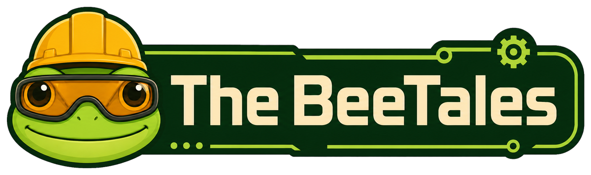
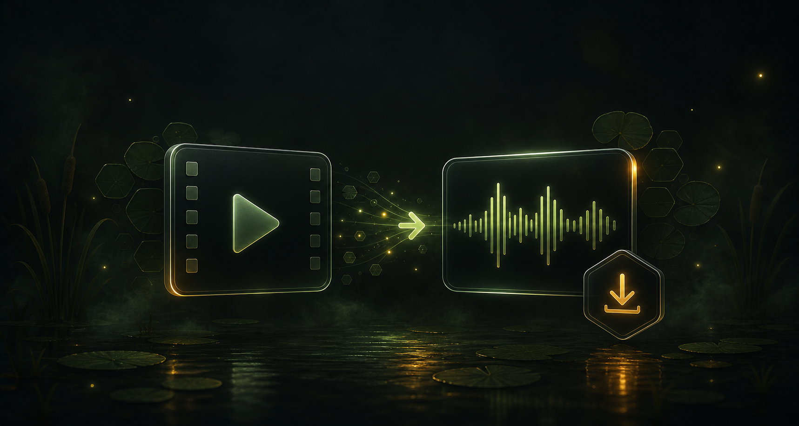
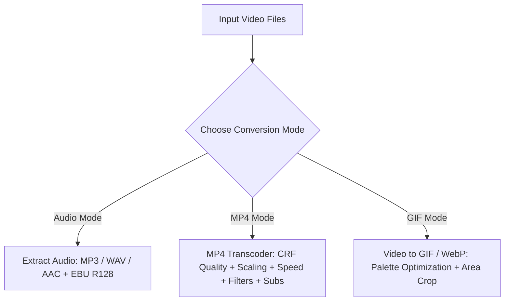
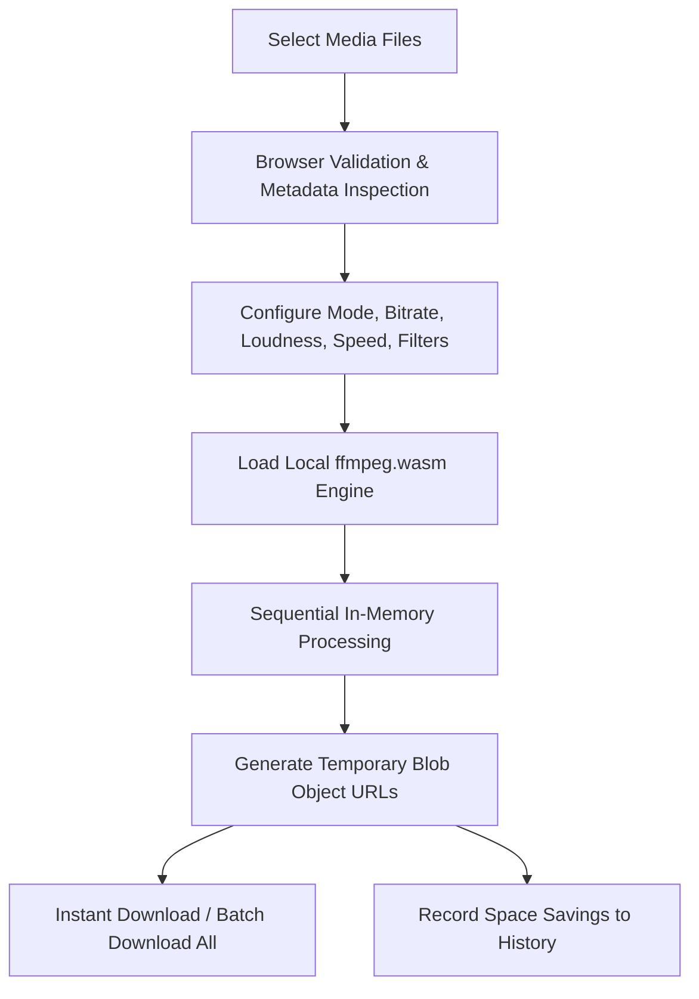

<p align="center">
  
</p>

<h1 align="center">BeeTales Media Converter</h1>

<p align="center">
  A private, ultra-fast, open-source media workstation that runs 100% locally in your web browser.
</p>

<p align="center">
  <a href="https://github.com/Sorairei/beetales-converter"><strong>View the repository</strong></a>
  ·
  <a href="https://github.com/Sorairei/beetales-converter/issues">Report an issue</a>
  ·
  <a href="https://github.com/sponsors/Sorairei">Sponsor the project</a>
</p>

<p align="center">
  <a href="LICENSE"></a>
  
  
  
  <a href="https://github.com/sponsors/Sorairei"></a>
</p>

<p align="center">
  
</p>

## Overview

**BeeTales Media Converter** is an open-source, local-first media powerhouse designed to extract high-bitrate audio, convert and optimize MP4 video, burn subtitles, normalize loudness, grade colors, and generate animated GIF/WebP clips—all executed inside your browser without uploading a single byte to external servers.

Powered by a compiled WebAssembly (FFmpeg) engine, it provides studio-grade conversion tools directly on your device with zero backend dependencies, zero subscriptions, zero cookies, and complete offline capability once loaded.

---

## Contents

- [Key Features](#key-features)
- [Conversion Modes & Capabilities](#conversion-modes--capabilities)
- [Advanced Video & Audio Tools](#advanced-video--audio-tools)
- [Multi-Language & User Guide](#multi-language--user-guide)
- [History & Space Savings Calculator](#history--space-savings-calculator)
- [Presets & Shareable Links](#presets--shareable-links)
- [How It Works](#how-it-works)
- [Privacy & Security Guarantees](#privacy--security-guarantees)
- [Architecture](#architecture)
- [Repository Structure](#repository-structure)
- [Local Development & Deployment](#local-development--deployment)
- [Quality & Automated Tests](#quality--automated-tests)
- [Contributing & Sponsorship](#contributing--sponsorship)
- [License](#license)

---

## Key Features

| Area | Capabilities |
| --- | --- |
| **100% Local Processing** | Files never leave your computer. All processing executes in browser memory via WebAssembly. |
| **Multi-Language (i18n)** | Full dynamic localization in **English (EN)**, **Español (ES)**, **Português (PT)**, and **Polski (PL)**. |
| **Interactive User Manual** | Built-in modal documentation guide explaining all features, loudness standards, and conversion modes. |
| **Audio Extraction** | High-fidelity MP3, WAV, and AAC export at 128k, 192k, or 320k bitrates with real-time waveform inspection. |
| **Loudness Normalization** | Industry-standard **EBU R128** normalization (Spotify, YouTube, Netflix standard) for balanced audio levels. |
| **Universal MP4 Engine** | WebM-to-MP4 transcoding, resolution scaling (1080p, 720p, 480p), CRF quality tuning, and fast-start streaming. |
| **Speed Control** | Variable video playback speed (**0.25× to 2×**) with automatic pitch and tempo audio synchronization (`atempo`). |
| **Color Grading Filters** | Instant color styling presets (**Vivid**, **High Contrast**, **Black & White**, **Cinematic Warm**). |
| **Audio Track Management** | Flexible channel routing (**Stereo**, **Mono downmix**, or **Full Mute**). |
| **Subtitles & Custom Audio** | Hardcode `.srt`/`.vtt` subtitles with styled borders or replace video audio tracks with custom music files. |
| **GIF & WebP Animation** | Two-pass palette-optimized animated GIFs or modern WebP clips with interactive visual area cropping. |
| **Frame Snapshot** | One-click **Save frame** button to export current video frame as high-resolution JPEG. |
| **Drag & Drop Queue** | Multi-file batch queue with native drag-and-drop reordering handles (`⋮⋮`). |
| **Conversion History** | Session history tracking input vs output sizes, compression percentages, and net space saved. |
| **Presets & URL Sharing** | Save configurations to `localStorage` or share direct settings via hash-encoded URLs. |

---

## Conversion Modes & Capabilities


```mermaid
graph TD
    A[Input Video Files] --> B{Choose Conversion Mode}
    B -->|Audio Mode| C[Extract Audio: MP3 / WAV / AAC + EBU R128]
    B -->|MP4 Mode| D[MP4 Transcoder: CRF Quality + Scaling + Speed + Filters + Subs]
    B -->|GIF Mode| E[Video to GIF / WebP: Palette Optimization + Area Crop]
```

### 1. Extract Audio
- **Supported Formats**: MP3 (128k, 192k, 320k), uncompressed WAV, and AAC.
- **Waveform Analysis**: Decodes audio with the Web Audio API to render visual waveforms for pinpointing audio peaks and silence.
- **Loudness Normalization**: EBU R128 filter ensures even volume levels across voice notes, interviews, and music.

### 2. Convert or Optimize MP4
- **Transcoding**: Converts WebM and heavy raw recordings to universally compatible H.264 / AAC MP4 with `+faststart` for web playback.
- **Quality Presets**: Smaller file (CRF 28), Balanced (CRF 23), or High Quality (CRF 18).
- **Resolution Scaling**: Downscale large 4K/1080p footage to 720p or 480p to reduce file weight.
- **Advanced Tools**: Custom subtitle burn-in, audio track replacement, speed adjustments, and color grading filters.

### 3. Video to GIF / WebP
- **Palette Optimization**: Two-pass palette generation ensures smooth color gradients without banding or heavy dithering artifacts.
- **Interactive Visual Cropping**: Drag-and-drop canvas handles allow cropping any rectangular frame area before rendering.
- **Output Formats**: Standard animated `.gif` or lightweight animated `.webp`.
- **Memory Safeguards**: GIF clips are bounded to 15 seconds to safeguard browser memory.

---

## Advanced Video & Audio Tools

### ◈ EBU R128 Loudness Normalization
Broadcast and streaming normalization standard prevents quiet audio or sudden jarring peaks without introducing acoustic distortion. Recommended for podcasts, interviews, and multi-clip montages.

### ◈ Subtitle Burn-In (`.srt` / `.vtt`)
Upload external subtitle files to hardcode subtitles directly into the video stream. Subtitles are styled with crisp, high-contrast borders for legibility on all backgrounds.

### ◈ Color & Style Grading
Apply non-destructive visual filters during MP4 encoding:
- **Vivid**: Enhances color saturation and punch.
- **High Contrast**: Deepens shadows and sharpens highlights.
- **Black & White**: Clean monochrome conversion.
- **Cinematic Warm**: Golden hour warm tones for storytelling.

### ◈ Audio Replacement & Track Selector
Add custom background music (`.mp3`, `.wav`, `.aac`, `.m4a`, `.ogg`) or silence unwanted background audio tracks with the Mono, Stereo, or Mute selectors.

---

## Multi-Language & User Guide

BeeTales includes full native localization for 4 languages with zero performance impact:
- **English (EN)**
- **Español (ES)**
- **Português (PT)**
- **Polski (PL)**

Language preferences are automatically persisted in `localStorage` (`beetales-lang-v1`).

### Interactive User Manual
Click the **User Guide & Help** button in the header to open a comprehensive, tabbed documentation modal covering:
1. **Overview & Workflow**: Step-by-step conversion quickstart.
2. **Formats & Modes**: Technical breakdown of codecs and settings.
3. **Audio & Loudness**: Understanding EBU R128 and bitrates.
4. **Video & Subtitles**: Guide to color filters, subtitles, and speed adjustments.
5. **Local Privacy**: How browser WebAssembly protects confidential media.

---

## History & Space Savings Calculator

BeeTales includes a persistent session history and space savings calculator:
- Tracks total files converted, input size vs. output size, and net megabytes saved.
- Floating history button with dynamic savings badge (e.g. `24.5 MB saved`).
- Modal breakdown displaying compression ratios per conversion (e.g. `-64% (12.3 MB)`).
- Clear history with a single click.

---

## Presets & Shareable Links

- **Saved Presets**: Save custom configurations (e.g. *"Podcast Audio 192k"*, *"WebM to 720p MP4"*) to `localStorage` for instant one-click recall.
- **Shareable URLs**: Click **Share link** to copy a URL containing all active settings encoded in the hash fragment (`#c=...`). Anyone opening the link will have the exact same settings preloaded automatically.

---

## How It Works


```mermaid
flowchart TD
    A[Select Media Files] --> B[Browser Validation & Metadata Inspection]
    B --> C[Configure Mode, Bitrate, Loudness, Speed, Filters]
    C --> D[Load Local ffmpeg.wasm Engine]
    D --> E[Sequential In-Memory Processing]
    E --> F[Generate Temporary Blob Object URLs]
    F --> G[Instant Download / Batch Download All]
    F --> H[Record Space Savings to History]
```

1. Files are loaded into browser memory via HTML5 File API.
2. FFmpeg WebAssembly core executes all operations locally in browser RAM.
3. Converted files are packaged as temporary `Blob` URLs ready for immediate download.
4. Temporary files are automatically cleaned up from memory after conversion.

---

## Privacy & Security Guarantees

| Concern | Guarantee |
| --- | --- |
| **Media Transmission** | **0% Network Traffic**. Files never leave your local device. |
| **Accounts & Registration** | **None**. No signup, authentication, or personal data collection. |
| **Cookies & Trackers** | **Zero**. No tracking scripts, advertising pixels, or telemetry on files. |
| **Offline Execution** | **100% Offline-Ready**. Once the page is loaded, conversions run without internet. |
| **Runtime Dependencies** | All FFmpeg WebAssembly modules, fonts, and assets are served locally from the repository. |

---

## Architecture & Repository Structure

```
beetales-converter/
├── index.html            # Application markup, i18n data tags, and dialog structures
├── app.js                # Core controller: ffmpeg lifecycle, queue, UI orchestration
├── translations.js       # Multi-language dictionary (EN, ES, PT, PL) & User Guide text
├── converter-utils.js    # Pure parsing, time formatting, crop filters, and calculations
├── style.css             # Base layout, typography, components, and responsive grid
├── theme.css             # Industrial Circuit theme, neon accents, and dark aesthetic
├── assets/               # Mascot, hero artwork, logos, and textures
├── vendor/ffmpeg/        # Local ffmpeg.wasm browser engine and WebAssembly binaries
└── test/
    └── helpers.test.js   # Automated unit tests for converter utilities
```

---

## Local Development & Deployment

### Run Locally
The application requires no build step. Serve over any HTTP server:

```bash
# Using Python
python3 -m http.server 8080

# Using Node.js (npx)
npx serve .
```

Then open `http://localhost:8080` in your web browser.

### GitHub Pages Deployment
BeeTales is 100% static and deploys seamlessly to GitHub Pages or static web hosts (Cloudflare Pages, Vercel, Netlify):

1. Go to repository **Settings** → **Pages**.
2. Select `main` branch and root `/` folder.
3. Save and your private converter is live globally.

---

## Quality & Automated Tests

Run the built-in Node test suite:

```bash
npm test
```

Tests validate:
- Time string parsing (`MM:SS`, `HH:MM:SS`, fractional seconds).
- Trim duration calculations and clamping.
- Crop filter coordinate computations.
- Safe filename generation and extension detection.
- Byte and duration formatting helpers.

---

## Contributing

Contributions that respect the **local-first, 100% client-side privacy architecture** are welcome!

1. Fork the repository.
2. Create your feature branch (`git checkout -b feature/amazing-feature`).
3. Commit your changes (`git commit -m 'feat: add amazing feature'`).
4. Push to the branch (`git push origin feature/amazing-feature`).
5. Open a Pull Request.

---

## Sponsorship

BeeTales Media Converter is free and open source. If this tool saves you time or server bandwidth costs, consider supporting continued maintenance:

👉 **[Sponsor Sorairei on GitHub](https://github.com/sponsors/Sorairei)**

---

## License

Released under the [MIT License](LICENSE). Copyright © 2026 [Sorairei](https://github.com/Sorairei).

<p align="center">
  Built with care by <a href="https://github.com/Sorairei">Sorairei</a> and the BeeTales community.
</p>
